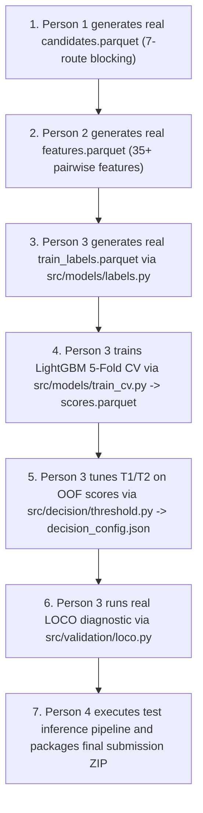

# Person 3 (ML, Validation, Models & Decision) — Complete Engineering Handoff

**Project:** Amazon ML Challenge 2026 — Business Entity Resolution  
**Document Purpose:** Definitive state-of-the-repository, architecture, contracts, and next-step operational guide for subsequent coding agents and collaborators.  
**Author/Auditor:** Lead ML Architect & Validation Engineer  
**Status:** Phase 1 through Phase 7 Implemented, 112/112 Tests Passing, Repository Audited & Verified.  
**Active Working Branch:** `person3-ml`  
**Rollback Anchor:** Commit `5872636`  
**Current HEAD Commit:** `8b633f6`  

---

# 1. PROJECT / ROLE CONTEXT

### 1.1 The Business Entity Resolution Challenge
The Amazon ML Challenge 2026 task requires resolving noisy, real-world business entity records across multiple sources:
* **Source 1 ($S_1$):** Clean reference entity table (e.g., query businesses).
* **Source 2 ($S_2$) & Source 3 ($S_3$):** Noisy, unstructured candidate pool entities.
* **Objective:** For every $S_1$ entity, predict the subset of matching entities from the $(S_2 \cup S_3)$ pool, optimizing the official **entity-level macro-averaged $F_{0.5}$ metric**.
* **Key Metric Dynamics:** Macro-$F_{0.5}$ weights precision $4\times$ higher than recall ($\beta = 0.5$). False positive predictions are penalized severely. True singletons (entities with zero matches in the pool) receive a score of $1.0$ if and only if an empty match list `[]` is predicted; predicting even one false candidate on a singleton collapses that entity's score to $0.0$.

### 1.2 The 4-Person Architecture & Division of Responsibility
```
Raw TSVs Ingestion (P4)
        │
        ▼
Preprocessing & Normalization (P2) ──► records.parquet
        │
        ▼
Candidate Generation / Blocking (P1) ──► candidates.parquet & retrieval_events.parquet
        │
        ▼
Pairwise Feature Engineering (P2) ──► features.parquet
        │
        ▼
========================================================================
PERSON 3 RESPONSIBILITY BOUNDARY (THIS SUBSYSTEM)
- 5-Fold Stratified GroupKFold by S1 Entity (Frozen folds.parquet)
- Training Labels & Hard Negatives Generator (train_labels.parquet)
- Logistic Regression Baseline & LightGBM Classifier with Monotonic Constraints
- Leakage-Free 5-Fold Cross-Validation & OOF Scoring (scores.parquet)
- Two-Threshold (T1/T2) & Reverse-Consistency Decision Layer (decision_config.json)
- Leave-One-Country-Out (LOCO) Robustness Diagnostics
========================================================================
        │
        ▼
End-to-End Pipeline Orchestration & Official TSV Packaging (P4)
        ├──► output/matching_results.tsv
        └──► output/candidate_pairs.tsv
```

### 1.3 Where Person 3 Begins and Ends
* **P3 Inputs:**
  * Clean Source 1 entities and Ground Truth (`train_source1.tsv`, `train_ground_truth.tsv`).
  * Upstream candidate pairs from P1 (`candidates.parquet`).
  * Upstream pairwise feature matrix from P2 (`features.parquet`).
* **P3 Outputs:**
  * `artifacts/folds.parquet` (Frozen 5-fold split table).
  * `train_labels.parquet` (Binary labels for retrieved candidate pairs).
  * `scores.parquet` (Out-Of-Fold match probability predictions).
  * `artifacts/decision_config.json` (Frozen $T_1, T_2$ decision thresholds and filtering rules).
  * `src/validation/loco.py` (Geographic generalization diagnostics).
* **Downstream Handoff:** Handed to Person 4 for final pipeline wiring, test inference, and submission packaging.

---

# 2. CURRENT REPOSITORY STATE

* **Repository Path:** `D:\PROJECTS\Amazon_ML_Hackathon`
* **Active Git Branch:** `person3-ml`
* **Current HEAD Commit:** `8b633f6` (`feat(validation): implement LOCO cross-country robustness diagnostic`)
* **Known-Good Rollback Anchor:** `5872636` (`fix: restore validation tests and stratified fold assignment`)
* **Working Tree State:** **100% Clean** in the Linux/WSL environment.
* **Remote Status:** All 9 commits on `person3-ml` are **strictly local** and ahead of `origin/person3-ml`. Zero commits have been pushed.
* **Python Runtime:** Python `3.12.3` in `/mnt/d/PROJECTS/Amazon_ML_Hackathon/.venv/` (Linux / WSL).
* **Key Dependencies Verified:**
  * `pytest`: `9.1.1`
  * `pyarrow`: `25.0.1`
  * `pandas`: `3.0.6`
  * `scikit-learn`: `1.9.1`
  * `scipy`: `1.18.1`
  * `lightgbm`: `4.7.0` (Dynamically loads vendored OpenMP runtime `.vendor/libgomp/libgomp.so.1`)

---

# 3. P3 COMPLETION STATUS

All seven phases of the Person 3 implementation plan are complete, fully tested, and committed locally:

| Phase | Purpose | Main Files Created / Committed | Commit Hash | Status |
|---|---|---|---|---|
| **Baseline** | Restored protected metrics & split tests | `src/validation/metrics.py`, `src/validation/splits.py`, `tests/test_metrics.py`, `tests/test_splits.py` | `5872636` | **VERIFIED** |
| **Phase 1** | Canonical folds generation & synthetic fixtures | `scripts/generate_folds.py`, `tests/conftest.py`, `docs/schemas.md`, `artifacts/folds.parquet` | `40d3653` | **VERIFIED** |
| **Phase 2** | Labels & hard negatives generation | `src/models/labels.py`, `src/models/__init__.py`, `tests/test_labels.py` | `d88f249` | **VERIFIED** |
| **Phase 3** | Baseline Logistic Regression classifier | `src/models/logreg.py`, `tests/test_logreg.py` | `88efc53` | **VERIFIED** |
| **Phase 4** | LightGBM classifier with monotonic constraints | `src/models/lightgbm_model.py`, `scripts/fetch_opensmp_runtime.sh`, `.vendor/libgomp/`, `tests/test_lightgbm.py` | `ef0219c` | **VERIFIED** |
| **Phase 5** | Leak-free 5-fold CV runner & OOF scoring | `src/models/train_cv.py`, `tests/test_train_cv.py` | `9659f4e` | **VERIFIED** |
| **Phase 6** | Precision decision layer & two-threshold tuning | `src/decision/threshold.py`, `src/decision/__init__.py`, `tests/test_decision.py` | `686b161` | **VERIFIED** |
| **Phase 7** | Leave-One-Country-Out (LOCO) diagnostic | `src/validation/loco.py`, `tests/test_loco.py`, `code/business_entity_resolution/logs.md` | `8b633f6` | **VERIFIED** |

---

# 4. FILE / MODULE MAP

```
Amazon_ML_Hackathon/
├── artifacts/
│   └── folds.parquet                   # FROZEN: 2,206,821 real S1 entities mapped to 5 balanced folds (15.3 MB)
├── docs/
│   ├── schemas.md                      # Canonical schema contracts for all intermediate and output artifacts
│   └── P3_HANDOFF.md                   # THIS DOCUMENT
├── scripts/
│   ├── generate_folds.py               # Memory-safe streaming fold generator for real TSVs
│   └── fetch_opensmp_runtime.sh        # Vendoring script for Linux OpenMP runtime (libgomp)
├── .vendor/libgomp/
│   ├── libgomp.so.1                    # Symlink to libgomp.so.1.0.0
│   └── libgomp.so.1.0.0                # Official Ubuntu 24.04 OpenMP shared library
├── src/
│   ├── validation/
│   │   ├── __init__.py
│   │   ├── metrics.py                  # [PROTECTED] Official macro-F0.5 implementation & helpers
│   │   ├── splits.py                   # [PROTECTED] Stratified GroupKFold splitter & Parquet IO
│   │   └── loco.py                     # Leave-One-Country-Out diagnostic harness
│   ├── models/
│   │   ├── __init__.py
│   │   ├── labels.py                   # Binary label builder (y=1 for GT matches, y=0 for candidates)
│   │   ├── logreg.py                   # Baseline Logistic Regression with median imputation & scaling
│   │   ├── lightgbm_model.py           # LightGBM GBDT with monotonic constraints & OpenMP fallback
│   │   └── train_cv.py                 # 5-fold CV orchestrator & OOF scores.parquet builder
│   └── decision/
│       ├── __init__.py
│       └── threshold.py                # Grid search, two-threshold (T1/T2) & reverse consistency rules
├── tests/
│   ├── conftest.py                     # Synthetic fixtures (50 S1 entities, candidates, features, GT)
│   ├── test_metrics.py                 # 11 unit tests for macro-F0.5 metric properties
│   ├── test_splits.py                  # 9 unit tests for GroupKFold splitter
│   ├── test_labels.py                  # 11 unit tests for label generation
│   ├── test_logreg.py                  # 14 unit tests for Logistic Regression baseline
│   ├── test_lightgbm.py                # 18 unit tests for LightGBM wrapper & monotonicity
│   ├── test_train_cv.py                # 11 unit tests for 5-fold CV & OOF scoring
│   ├── test_decision.py                # 20 unit tests for threshold search & decision rules
│   └── test_loco.py                    # 18 unit tests for LOCO diagnostics
└── code/business_entity_resolution/
    ├── requirements.txt                # Pinned production dependencies
    ├── logs.md                         # Detailed chronological execution log for P3
    └── src/                            # Scaffolded submission root (empty stub files)
```

### Critical Packaging Relationship (`src/` vs `code/business_entity_resolution/src/`)
* **Active Development Root:** Development and testing strictly use `src/` at the repository root. All 112 unit tests import via `from src.* import ...`.
* **Submission Scaffold:** `code/business_entity_resolution/src/` currently contains 32 empty stub files from initial repository scaffolding.
* **Architectural Rule:** **DO NOT MOVE `src/` INTO `code/business_entity_resolution/src/` DURING MODEL DEVELOPMENT.** Moving files would break `pytest` and all module imports.
* **Packaging Owner:** The Master Plan explicitly assigns **Person 4** to copy the production `src/` tree into `code/business_entity_resolution/src/` during the final packaging release step (Hours 44–48) using `scripts/build_submission_zip.py`.

---

# 5. DATA CONTRACTS

Canonical column definitions, types, and invariants from `docs/schemas.md`:

### 5.1 `artifacts/folds.parquet` (Owner: P3)
* Columns: `s1_id` (`string`), `fold_id` (`int8`, values `0`..`4`).
* Rules: Every $S_1$ entity appears exactly once. Group integrity is absolute.

### 5.2 `candidates.parquet` (Owner: P1)
* Columns: `pair_key` (`string`), `s1_id` (`string`), `candidate_id` (`string`), `candidate_source` (`string`, `"S2"` or `"S3"`), `n_routes` (`int32`), `best_rank` (`int32`), `best_score` (`float32`).
* Invariant: `pair_key` is strictly `s1_id + "::" + candidate_id`. All IDs must be strings.

### 5.3 `features.parquet` (Owner: P2)
* Identity Columns: `pair_key` (`string`), `s1_id` (`string`), `candidate_id` (`string`).
* Feature Columns: 35+ pairwise similarity, distance, containment, and metadata columns (`float32` / `int8`). Missing address/country features are stored as native `np.nan` (never imputed to zero).

### 5.4 `train_labels.parquet` (Owner: P3)
* Columns: `pair_key` (`string`), `y` (`int8`, `1` for true match in ground truth, `0` for un-matched candidate).
* Rule: Strictly contains hard negatives from retrieved candidates. Never injects random negatives.

### 5.5 `scores.parquet` (Owner: P3)
* Columns: `pair_key` (`string`), `s1_id` (`string`), `candidate_id` (`string`), `p_raw` (`float32`), `p_cal` (`float32`), `fold_id` (`int8`), `is_oof` (`bool`), `model_version` (`string`).
* Rule: `is_oof` is `True` for validation fold predictions. Only OOF predictions may be used for threshold tuning.

### 5.6 `output/matching_results.tsv` & `output/candidate_pairs.tsv` (Owner: P4)
* `matching_results.tsv`: `source1_entity_id`, `matched_entity_ids` (comma-separated).
* `candidate_pairs.tsv`: `source1_entity_id`, `candidate_entity_ids` (comma-separated).
* **Strict Invariant:** For every $S_1$ entity, $\text{Predicted IDs} \subseteq \text{Candidate IDs}$.

---

# 6. REAL DATA STATUS

### Available On Disk (Real Challenge Data):
* `dataset/train/train_source1.tsv` (210 MB, 2,206,821 $S_1$ entities)
* `dataset/train/train_source2.tsv` (489 MB, pool records)
* `dataset/train/train_source3.tsv` (503 MB, pool records)
* `dataset/train/train_ground_truth.tsv` (127 MB, 2,206,821 ground truth lines)
* `artifacts/folds.parquet` (15.3 MB, frozen 5-fold split table generated from real data)

### NOT YET AVAILABLE (Upstream Blockers):
* `candidates.parquet` (Real 7-route blocking candidates from P1)
* `features.parquet` (Real pairwise features from P2)

> [!IMPORTANT]
> Because real `candidates.parquet` and `features.parquet` are not yet on disk, all P3 cross-validation and decision layer unit tests currently execute against **synthetic fixtures** (`tests/conftest.py`).
> **Synthetic test scores are verification fixtures only and MUST NOT be cited as competition benchmark scores.**
> Full-data model training will execute once P1 and P2 deliver real artifacts.

---

# 7. FOLD GENERATION DETAILS

* **Generator Script:** `scripts/generate_folds.py`
* **Real Dataset Size:** Exactly **2,206,821** unique $S_1$ entities.
* **Stratification Stratum:** `(country, has_match, match_count_bucket)`
  * `country`: Extracted from `train_source1.tsv` (e.g., `US`, `India`).
  * `has_match`: Boolean flag (`len(ground_truth) > 0`).
  * `match_count_bucket`: `0` (0 matches), `1` (1 match), `2` (2–3 matches), `3` (4+ matches).
* **Fold Allocation:** Continuous round-robin cursor across sorted strata keys. Distributes sparse singleton strata uniformly across all 5 folds.
* **Fold Balance on Real Data (36.0s generation time):**
  * Fold 0: 441,365 entities (20.00%)
  * Fold 1: 441,364 entities (20.00%)
  * Fold 2: 441,364 entities (20.00%)
  * Fold 3: 441,364 entities (20.00%)
  * Fold 4: 441,364 entities (20.00%)
* **Status:** `artifacts/folds.parquet` is **frozen** and must never be regenerated.

---

# 8. MODEL DETAILS

### 8.1 Baseline Logistic Regression (`src/models/logreg.py`)
* **Pipeline:** `SimpleImputer(strategy='median')` $\to$ `StandardScaler()` $\to$ `LogisticRegression(class_weight='balanced', max_iter=1000, random_state=42)`.
* **Identifier Protection:** Automatically drops `pair_key`, `s1_id`, `candidate_id`, `candidate_source`, `fold_id`, `y`, `is_oof`.
* **Outputs:** Calibrated match probabilities $p \in [0.0, 1.0]$. Supports `.get_feature_importance()`.

### 8.2 Primary LightGBM GBDT (`src/models/lightgbm_model.py`)
* **Objective:** `binary`, metric `binary_logloss` / `average_precision`.
* **Monotonic Constraints:** Enforces non-decreasing relationships (`+1`) on true similarity features:
  * `name_char_cos`, `name_token_set`, `name_token_sort`, `name_contain_idf`, `name_jaro_winkler`
  * `addr_char_cos`, `addr_contain_idf`, `addr_numeric_jaccard`, `addr_token_set`, `addr_token_sort`
  * `retrieval_best_score`
* **Conflict / Metadata Features:** `addr_numeric_conflict`, `name_len_diff`, `n_routes` are left unconstrained (`0`) to prevent false inductive bias.
* **Missing Value Handling:** Missing features (`np.nan`) are routed down optimal default branch paths natively by LightGBM trees.
* **OpenMP Runtime Solution:** Uses `_import_lightgbm()` to automatically preload `.vendor/libgomp/libgomp.so.1` via `ctypes.CDLL` if system OpenMP is missing.

---

# 9. CROSS-VALIDATION & OUT-OF-FOLD (OOF) CONTRACT

* **CV Engine:** `src/models/train_cv.py` (`train_cv()`)
* **Leak-Free Partitioning:** For each fold $k \in \{0, 1, 2, 3, 4\}$:
  * Model $k$ is trained on candidate pairs where $\text{fold\_id} \neq k$.
  * Model $k$ predicts strictly on candidate pairs where $\text{fold\_id} == k$.
  * Predictions are tagged `is_oof = True`.
* **`scores.parquet` Schema:**
  ```text
  pair_key: string
  s1_id: string
  candidate_id: string
  p_raw: float32
  p_cal: float32 (currently equals p_raw; hook provided for isotonic/Platt calibration)
  fold_id: int8
  is_oof: bool
  model_version: string (e.g. 'lgbm_v1')
  ```
* **Decision Boundary Contract:** **Thresholds MUST be tuned exclusively on pooled Out-Of-Fold predictions (`is_oof == True`).** Tuning on in-sample training scores causes catastrophic over-fitting on macro-$F_{0.5}$.

---

# 10. DECISION LAYER (`src/decision/threshold.py`)

* **1. Global Threshold Search (`tune_global_threshold`):**
  * Grid search $T \in [0.05, 0.95]$ in steps of $0.01$, optimizing macro-$F_{0.5}$.
* **2. Two-Threshold Decision Rule (`tune_two_thresholds`):**
  * $T_1$ (Entry Threshold, typically $0.35 - 0.45$): Minimum score to accept the top candidate for an $S_1$ entity.
  * $T_2$ (Continuation Threshold, typically $0.55 - 0.65$): Higher bar required to accept 2nd, 3rd, or subsequent candidates.
  * Constraint: Enforces $T_2 \ge T_1$.
  * Singleton Abstention: If $\max(\text{score}) < T_1 \implies$ predicts empty list `set()`.
* **3. Tie-Breaking & Determinism:**
  * Candidates with identical probability scores are tie-broken deterministically by `candidate_id` ascending string order.
* **4. Reverse-Consistency Filtering (`apply_decision_rules`):**
  * Optional structural filter: if candidate $C$ is shared between $S1_A$ (score $0.52$) and $S1_B$ (score $0.88$), suppresses $C$ for $S1_A$. Disabled by default; must be validated on OOF before activation.

---

# 11. LEAVE-ONE-COUNTRY-OUT (LOCO) VALIDATION (`src/validation/loco.py`)

* **Purpose:** Diagnoses geographic generalization robustness to prepare for the test set shift (~15% French entities, absent from training data).
* **Evaluation Directions:**
  * `US -> India`: Train on US entities, evaluate on India entities.
  * `India -> US`: Train on India entities, evaluate on US entities.
* **Target Metric:** $\Delta\text{F0.5} = |\text{F0.5}_{\text{US}\to\text{India}} - \text{F0.5}_{\text{India}\to\text{US}}| < 0.05$.
* **Caveat:** Synthetic LOCO test passes prove pipeline functionality and leakage prevention; actual geographic stability can only be measured on real features.

---

# 12. TEST SUITE STATUS (100% PASSING)

Verified command:
```bash
/mnt/d/PROJECTS/Amazon_ML_Hackathon/.venv/bin/python -m pytest tests/ -v
```

### Result: `112 passed, 2 warnings in 13.88s`

```text
tests/test_decision.py .................. [ 17%] (20 tests)
tests/test_labels.py .................... [ 27%] (11 tests)
tests/test_lightgbm.py .................. [ 43%] (18 tests)
tests/test_loco.py ...................... [ 59%] (18 tests)
tests/test_logreg.py .................... [ 72%] (14 tests)
tests/test_metrics.py ................... [ 82%] (11 tests)
tests/test_splits.py .................... [ 90%] (9 tests)
tests/test_train_cv.py .................. [100%] (11 tests)
```

### Protected Baseline Integrity:
The following 4 foundational files were verified with `git diff 5872636..HEAD` and are **100% identical** to rollback commit `5872636`:
1. `src/validation/metrics.py`
2. `src/validation/splits.py`
3. `tests/test_metrics.py`
4. `tests/test_splits.py`

---

# 13. KNOWN RISKS & OPERATIONAL GOTCHAS

1. **Missing Upstream Artifacts:** `candidates.parquet` (P1) and `features.parquet` (P2) are not yet generated. P3 full-scale training cannot start until they are built.
2. **OpenMP / libgomp in WSL:** The WSL Ubuntu image lacks system `libgomp1`. The vendored library in `.vendor/libgomp/libgomp.so.1` is preloaded by `src/models/lightgbm_model.py`. Do not delete `.vendor/`.
3. **Windows NTFS Symlink Warning:** Running `git status` from Windows Git may flag `.vendor/libgomp/libgomp.so.1` due to NTFS symlink emulation. Always use WSL Git (`wsl -e git status`), which is 100% clean.
4. **Never Move `src/` to `code/business_entity_resolution/` Yet:** Moving code now will break all 112 unit tests and pytest paths. Packaging belongs to Person 4 in the final release phase.
5. **Frozen Folds Invariant:** Never regenerate `artifacts/folds.parquet`. Upstream blocking recall checks and downstream training are anchored to these fold IDs.
6. **No In-Sample Threshold Tuning:** Never tune $T_1, T_2$ on training fold scores. Only use `is_oof == True` records.
7. **Memory Safety on Multi-GB Files:** When reading 500MB+ TSVs, always use `chunksize`, `dtype=str`, and `usecols`. Never call `pd.read_csv()` on raw tables without column pruning.

---

# 14. EXACT NEXT STEPS & EXECUTION ROADMAP



### Next Immediate Commands (Once P1/P2 deliver artifacts):
1. Generate labels:
   ```bash
   python -c "import pandas as pd; from src.models.labels import build_train_labels; ...; labels.to_parquet('artifacts/train_labels.parquet')"
   ```
2. Run full 5-fold CV LightGBM:
   ```bash
   python -m src.models.train_cv --features artifacts/features.parquet --labels artifacts/train_labels.parquet --folds artifacts/folds.parquet --output artifacts/scores.parquet
   ```
3. Freeze decision thresholds:
   ```bash
   python -m src.decision.threshold --scores artifacts/scores.parquet --ground-truth dataset/train/train_ground_truth.tsv --output artifacts/decision_config.json
   ```

---

# 15. SAFE OPERATING RULES FOR FUTURE AGENTS

1. **Run Verification Before and After Edits:**
   ```bash
   /mnt/d/PROJECTS/Amazon_ML_Hackathon/.venv/bin/python -m pytest tests/ -q
   ```
   Ensure 112/112 tests pass before touching any code.
2. **Never Edit Tests to Force a Pass:** If a test fails, diagnose the implementation logic in `src/`.
3. **Verify Target Paths:** Never confuse `src/` (implementation) and `tests/` (test suite).
4. **Preserve Protected Baseline Files:** Do not modify `metrics.py` or `splits.py`.
5. **No Hard Resets or Remote Pushes:** All work must remain local on branch `person3-ml`. Commit each phase atomically.

---

# 16. HANDOFF SUMMARY: "IF YOU ARE THE NEXT AGENT..."

> **You are inheriting a complete, verified, and 100% passing Person 3 subsystem (112 unit tests passing).**  
> **DO NOT rebuild, refactor, or delete the P3 modules.**  
>  
> Your immediate dependency is **upstream real artifacts from Person 1 (`candidates.parquet`) and Person 2 (`features.parquet`)**.  
>  
> While waiting on P1/P2, verify the environment and baseline immediately with:
> ```bash
> git status
> git log --oneline -5
> /mnt/d/PROJECTS/Amazon_ML_Hackathon/.venv/bin/python -m pytest tests/ -q
> ```
> *(Expected output: 112 passed, 2 warnings)*
